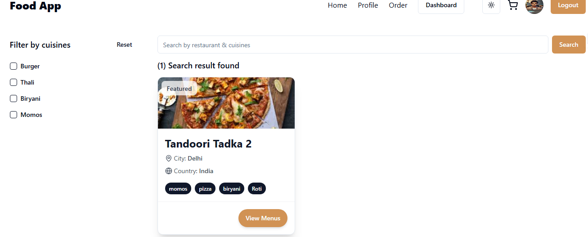
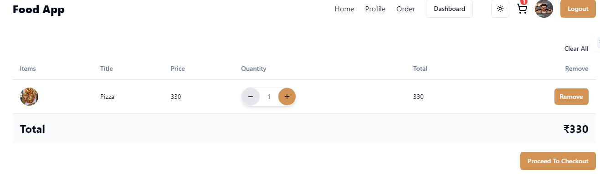
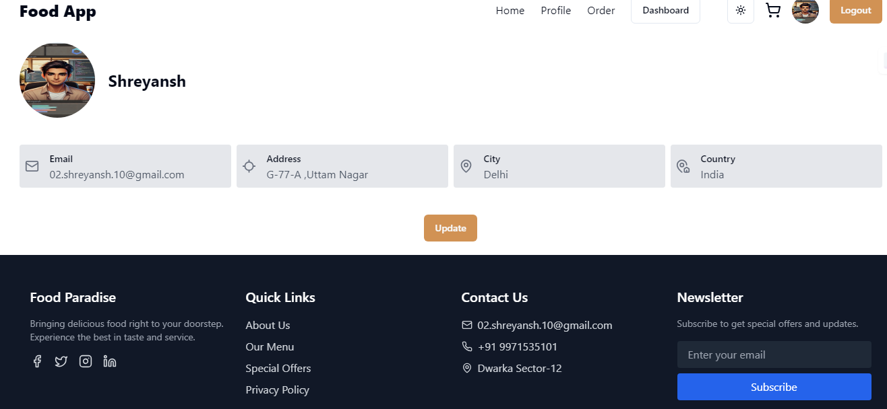
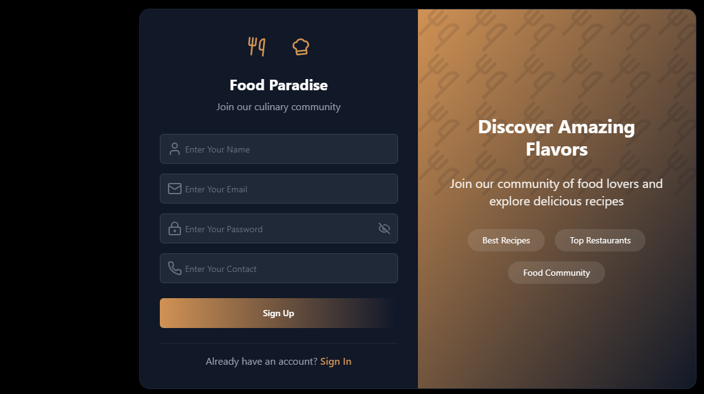
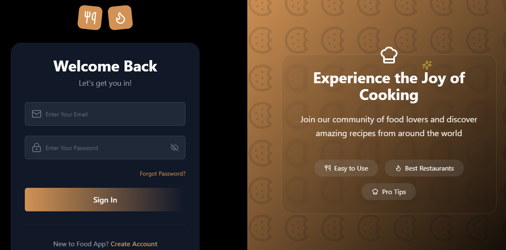
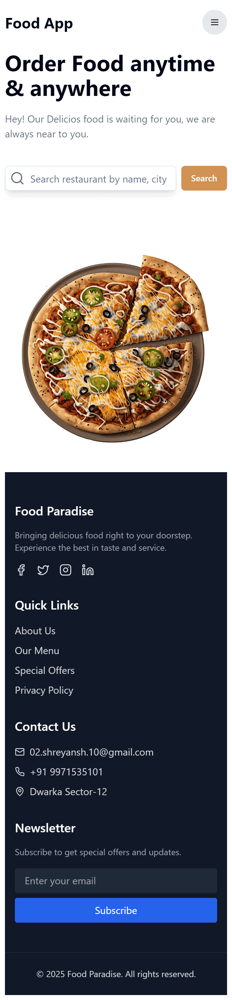
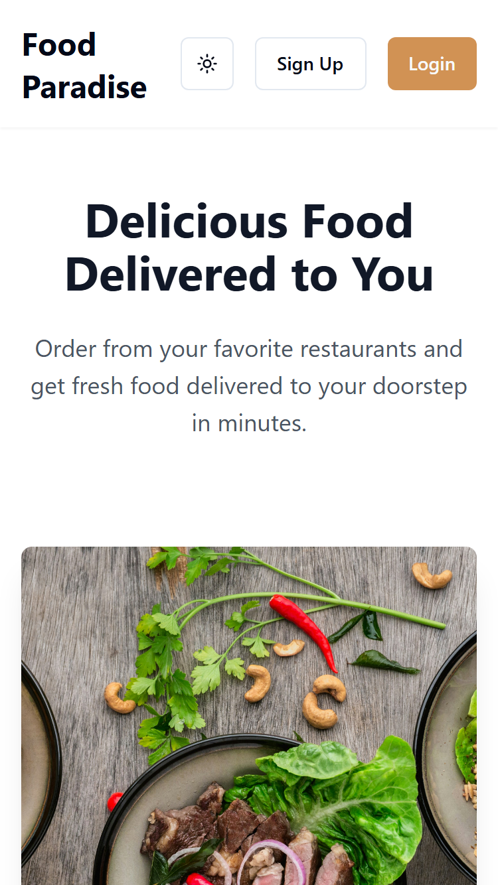
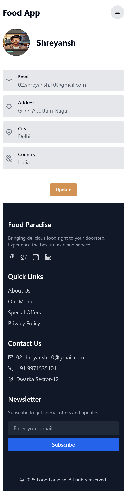

# 🍽️ Food Paradise

## 🚀 Overview
**Food Paradise** is a web application that integrates food menus from various local food shops into one platform. It eliminates the need for manual food menus, allowing customers to browse menus and place orders conveniently. The application also helps food shop owners manage prices, update menus, and add or remove items without the recurring cost of printing.

## 🎯 Objective
- To digitize and streamline the management of food menus for local food shops.
- To provide an efficient and user-friendly interface for customers to browse and order food.
- To reduce costs associated with printing and manual updates of menus.
- To enhance user experience with a clean and organized food ordering system.

## 🏗️ Tech Stack
- **Frontend:** React.js, Tailwind CSS, ShadCN  
- **Backend:** Node.js (Microservices Architecture)  
- **Database:** MongoDB  

## 🌟 Features
✔️ **Centralized Menu Management** – All food menus are available in a single app.  
✔️ **Easy Menu Updates** – Shop owners can add, update, or remove items anytime without extra costs.  
✔️ **User-Friendly Interface** – A clean and interactive UI for seamless food browsing.  
✔️ **Cost-Effective** – Eliminates the need for manual printing and menu distribution.  
✔️ **High Performance** – Built with modern technologies ensuring smooth operation.  

## 🌍 Live Demo
🔗 [Food Paradise - Live Site](https://food-paradise-3zpn.onrender.com/)

## 🖼️ Screenshots
## Desktop
<p align="center">
  
  
  
  
  
  
</p> 

## Mobile 
<p align="center">
  
  
  
</p>

> *(ScreenShots of Food Paradise App aka Food App)*

---

## Contribution Guidelines 🤝
We welcome contributions! Follow these steps to contribute:

1. Fork the repository.
2. Clone your fork:  
   ```bash
   git clone https://github.com/your-username/Food_Paradise.git
   ```
3. Create a new branch:  
   ```bash
   git checkout -b feature-name
   ```
4. Make your changes and commit:  
   ```bash
   git commit -m "Added new feature"
   ```
5. Push to your fork and submit a Pull Request:  
   ```bash
   git push origin feature-name
   ```

## 👤 Developer
This project was independently developed by **Shreyansh**. It demonstrates the impact of digital menu management, offering cost efficiency and enhanced user experience.  

---

Hope this helps! Let me know if you need any modifications. 🚀  
